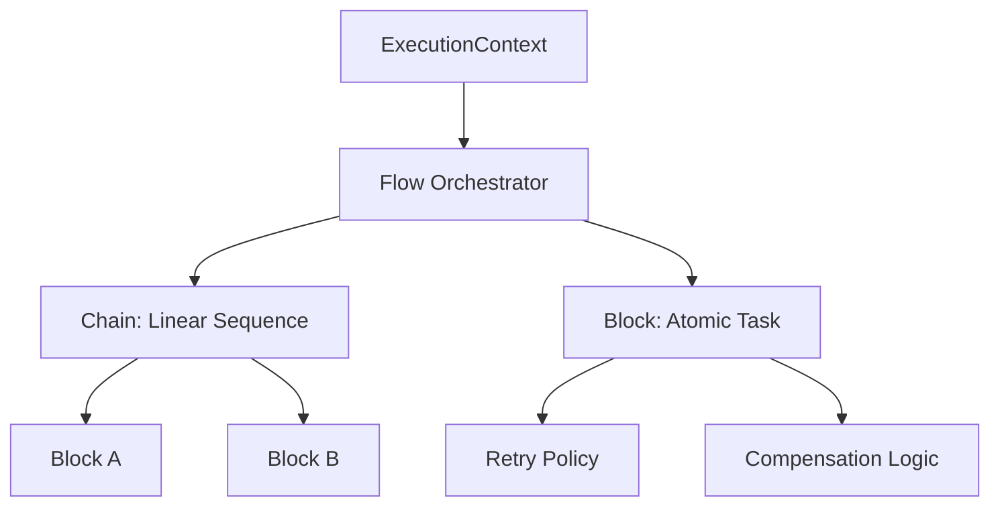

# **Introduction to VibeBlocks**

**VibeBlocks** is a framework-agnostic Python library engineered for the next generation of software: AI-driven autonomous systems and reactive agents. It provides the deterministic scaffolding required to transform unpredictable AI reasoning into reliable, production-grade execution flows.

At its core, VibeBlocks adheres to a **"Zero-Gravity" Philosophy**: it carries no heavy third-party dependencies, ensuring maximum portability and minimal footprint in any Python environment.

## **The Problem: AI Reasoning vs. Deterministic Execution**

While Large Language Models (LLMs) are exceptional at reasoning and planning, they are inherently non-deterministic. Building production systems around them requires a layer that can:

1. Enforce strict execution boundaries.  
2. Manage complex state transitions across atomic blocks.  
3. Provide robust failure recovery and compensation (rollback) logic.

VibeBlocks solves this by providing a high-level orchestration layer that treats business logic as a graph of **Executable Units**.

## **High-Level Architecture**

VibeBlocks utilizes a composite pattern to organize logic into a hierarchical structure. This allows for both simplicity in small tasks and extreme scalability in complex enterprise workflows.

## **Strategic Positioning**

In the modern Python ecosystem, VibeBlocks occupies a unique niche between data orchestrators and AI frameworks.

| Feature | VibeBlocks | LangChain/LlamaIndex | Airflow/Prefect |
| :---- | :---- | :---- | :---- |
| **Primary Goal** | Reliable Task Execution | AI Integration & Data RAG | Scheduled Data Pipelines |
| **Dependencies** | None (Zero-Gravity) | High | High (DB \+ Workers) |
| **Execution** | Reactive / Real-time | Agentic / Planning | Batch / Scheduled |
| **Failure Logic** | Built-in Compensation | Limited | Simple Retries |

## **Key Use Cases**

* **Autonomous AI Agents:** Provide a safe "sandbox" of tools that the agent can trigger via structured JSON schemas.  
* **Microservices Orchestration:** Manage multi-step transactions across distributed services with automated rollbacks.  
* **Reactive ETL:** Execute lightweight data transformation flows that trigger instantly on events rather than waiting for a batch window.  
* **Resilient Bot Backends:** Power complex interaction flows for Telegram, Slack, or Discord bots with stateful context management.

*Engineered with precision by AA Digital Business. High-end AI Architecture.*